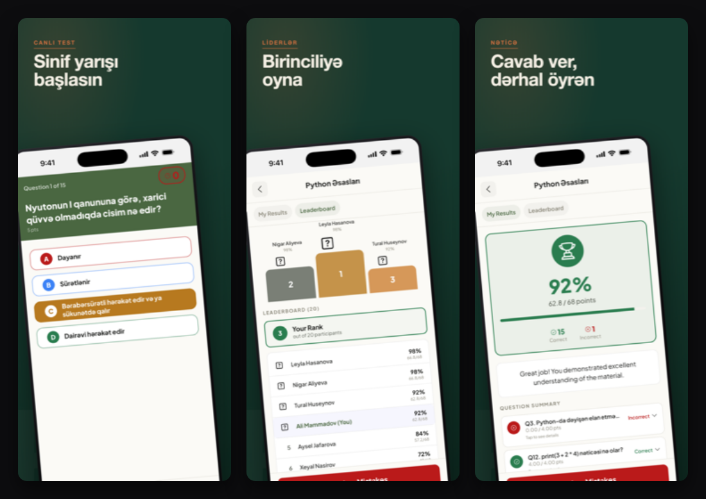

# Mobile Release Kit

**Ship Expo / React Native apps to the App Store and Google Play — screenshots, listings, and the EAS submit dance, minus the trial and error.**

Getting an app onto the stores is mostly undocumented friction: screenshots at the wrong pixel size, a Play submit that dies on a service-account permission, a review rejected because the demo login didn't work, framing that makes a good app look like a template. This kit packages the parts that are easy to get wrong, with the judgment calls already made.

It's a [Claude Code](https://code.claude.com) plugin **and** a set of standalone Node/Bash scripts — use whichever fits.



<sub>Real output from the kit (the app it was extracted from). Your palette, headlines, and screens; same pipeline.</sub>

---

## Contents

- [Why this exists](#why-this-exists)
- [Quickstart](#quickstart) · [install in your agent](#install-in-your-agent) · [as plain scripts](#path-b--standalone-scripts) · [as an MCP server](#as-an-mcp-server)
- [The opinionated part: framing](#the-opinionated-part-framing)
- [Gotchas it already knows](#gotchas-it-already-knows)
- [What's in the box](#whats-in-the-box)
- [Repository layout](#repository-layout)
- [Scope & limitations](#scope--limitations)

---

## Why this exists

Three things in a store release are high-leverage and routinely done badly:

1. **Screenshots** are the single biggest driver of installs, and the easiest to make look amateur. This kit captures them (live simulator *or* web bundle) and frames them into marketing images whose defaults come from App Store ASO research, not taste.
2. **The EAS submit flow** has a dozen failure modes that each cost an afternoon the first time. They're written down here as a runbook with the fixes inline.
3. **Listings & review notes** get apps rejected over trivia (a demo credential that doesn't work, a missing support URL). Templates enforce the limits and the must-haves.

Extracted from a shipped Kahoot-style education app, then generalized so the specifics are yours to fill in.

---

## Quickstart

Three ways to use it: as a **plugin in your AI agent**, as **plain scripts**, or as an **MCP server**.

### Install in your agent

The skills, the canonical `AGENTS.md`, and the standalone scripts work across agents. Install per harness (install separately for each one you use):

| Agent | Install |
|-------|---------|
| **Claude Code** | `/plugin marketplace add turbo-launch/mobile-release-kit` then `/plugin install mobile-release-kit@turbo-launch` |
| **Codex** (CLI/app) | Add the repo via the Codex plugin marketplace, or clone it — Codex reads `AGENTS.md` natively. |
| **Cursor** | Install from the Cursor plugin marketplace, or clone — Cursor reads `AGENTS.md` and the `skills/` (SKILL.md) natively. |
| **Gemini CLI** | `gemini extensions install https://github.com/turbo-launch/mobile-release-kit` |
| **Kimi Code** | Install from Kimi's plugin marketplace, or `/plugins install https://github.com/turbo-launch/mobile-release-kit` |
| **OpenCode** | Add `"mobile-release-kit@git+https://github.com/turbo-launch/mobile-release-kit.git"` to your `opencode.json` `plugin` array — see [`.opencode/INSTALL.md`](.opencode/INSTALL.md) |
| **Copilot / Windsurf / Amp / Cline / Zed** | Clone the repo into your project — these read `AGENTS.md` automatically. |

Then just ask — "capture store screenshots and frame them" · "ship this to TestFlight" — and the agent follows the right skill. In Claude Code you also get slash commands (`/mobile-release-kit:frame-screenshots`, `/mobile-release-kit:release`) and the **release-orchestrator** agent, which stops before anything billed or irreversible.

> One source of truth: `AGENTS.md` holds the instructions; `CLAUDE.md`/`GEMINI.md` point at it; each `.{claude,codex,cursor,kimi}-plugin/` manifest reuses the same `skills/`. No content is duplicated per agent.

### Path B — standalone scripts

Plain Node + [Playwright](https://playwright.dev); runs in any shell or CI, no Claude Code needed.

```bash
# one-time: a Chromium for Playwright
npm i -D playwright && npx playwright install chromium

# 1. (optional) capture a screen from a booted simulator — macOS only
xcrun simctl list devices booted                  # grab the UDID
./scripts/sim-capture.sh <UDID> raw/home.png phone # clean 9:41 status bar, native res

# 2. frame a folder of raw screenshots into store images — one config drives every size
node scripts/frame-screenshots.js frames.config.json ./raw ./out iphone-6.9
node scripts/frame-screenshots.js frames.config.json ./raw ./out ipad-13
node scripts/frame-screenshots.js frames.config.json ./raw ./out android-phone

# 3. tile the set to eyeball the whole story at once
node scripts/contact-sheet.js ./out ./contact-sheet.png 5
```

Copy [`templates/frames.config.json`](templates/frames.config.json), set the palette and per-screen `eyebrow`/`head` copy, and order the screens — **frame 1 = your most exciting screen.** In a Bun/Expo monorepo that already has Playwright, reuse it: `NODE_PATH=./node_modules node scripts/frame-screenshots.js …`.

### As an MCP server

The framing tools are also exposed over [MCP](https://modelcontextprotocol.io) (stdio), for agents that prefer a typed tool surface or that gate the shell (e.g. unattended cloud agents). A committable [`.mcp.json`](.mcp.json) is included:

```jsonc
// .mcp.json — read by Claude Code, Cursor, Gemini CLI, Cline, Windsurf
{ "mcpServers": { "mobile-release-kit": { "command": "node", "args": ["scripts/mcp-server.js"] } } }
```

```bash
npm install                      # @modelcontextprotocol/sdk + zod (+ playwright)
node scripts/mcp-server.js       # exposes: frame_screenshots, contact_sheet
```

For most agents this is optional — they can run the scripts via their shell tool straight from [`AGENTS.md`](AGENTS.md), which is lighter on context. Reach for MCP when the shell is restricted or you want validated parameters.

---

## The opinionated part: framing

A device-on-a-gradient with a headline is easy. A device-on-a-gradient that *converts* follows rules most generated screenshots break. The renderer's defaults encode them:

- **Lead with the peak moment.** Frame 1 is the live / most-exciting screen — never a calm dashboard, splash, or settings page. The first three frames carry the bulk of the install decision, so they go: peak moment → competitive payoff → instant "aha".
- **Straight-on device.** The 3D-tilted phone reads dated; tilt is opt-in, off by default.
- **One background system, hottest hero.** Consistent palette across the set, but the hero frame gets the most saturated `tone` so it pops in the thumbnail strip.
- **Benefit headlines, 2–4 words** — plus an optional energy "pop" chip (a big number, rank, or %) on the competitive frames.

Every screen is one entry in a JSON config — no per-app code. Output lands at the exact required pixel sizes:

| Device key | Pixels | Notes |
|------------|--------|-------|
| `iphone-6.9` | 1320×2868 | Apple's required size; covers all smaller iPhones |
| `ipad-13` | 2064×2752 | only if `supportsTablet` |
| `android-phone` | 1080×2400 | Play recommended |
| `android-tablet` | 1600×2560 | Play 10-inch tablet |

---

## Gotchas it already knows

The runbook and skills carry the fixes for the failures that bite everyone:

- **Play "service account missing permissions"** on `eas submit` → invite the `eas-*@*.iam.gserviceaccount.com` email in Play Console and grant Release permission.
- **App Store Connect version mismatch** (page shows the old version) → edit the draft version or create a new one.
- **Review rejection (Guideline 2.1)** → demo credentials in the review notes must actually work; the listing template makes that a required field.
- **Screenshots that ship broken** — the web-capture path *asserts a screen isn't empty/errored before it screenshots*, because "a PNG was written" is not "the PNG is good."
- **Dev chrome in shots** (Expo dev-launcher gear, `__DEV__` quick-login) → the live-capture skill walks scrubbing it without shipping the change.
- **A 74 MB `.aab` committed to git** → a bundled hook warns you before it happens; the gitignore snippet prevents it.
- **Hermes vs. web `Intl`** date garbage, wrong-platform RN-Web controls in iOS shots, stale Metro bundle — all documented where they'd otherwise eat an afternoon.

---

## What's in the box

| Type | Name | Does |
|------|------|------|
| Skill | `framing-store-screenshots` | Raw screenshots → framed marketing images |
| Skill | `capturing-store-screenshots-live` | Native iOS Simulator capture (live / multiplayer hero screens) |
| Skill | `capturing-store-screenshots-web` | Expo web-bundle capture (fast static batches, CI-friendly) |
| Skill | `releasing-with-eas` | EAS build → submit → review runbook |
| Skill | `writing-store-listings` | Listing copy + review notes within store limits |
| Command | `/…:frame-screenshots` | One-shot framing of a screenshot folder |
| Command | `/…:release` | Walk the EAS runbook (stops before billed actions) |
| Agent | `release-orchestrator` | Runs the whole pipeline across the skills |
| Hook | — | Warns before a `git` command commits a build artifact |
| Scripts | `frame-screenshots.js`, `contact-sheet.js`, `sim-capture.sh`, `sim-clean-statusbar.sh`, … | The standalone tools |
| Templates | `frames.config.json`, `eas.json`, listing + `PUBLISH`/`PREFLIGHT` runbooks, gitignore snippet | Copy-and-fill starting points |

---

## Repository layout

```text
mobile-release-kit/
├── AGENTS.md            # canonical agent instructions (CLAUDE.md/GEMINI.md point here)
├── skills/              # the five release skills (shared by every agent)
├── commands/            # /frame-screenshots, /release  (Claude/Codex/Cursor)
├── agents/              # release-orchestrator
├── hooks/               # build-artifact safety guard
├── scripts/             # frame-screenshots.js, contact-sheet.js, mcp-server.js, sim-*.sh
├── templates/           # frames.config.json, eas.json, listings, PUBLISH/PREFLIGHT
├── docs/                # release-tree convention, store specs, media
├── .mcp.json            # MCP server config
├── .claude-plugin/      # Claude Code manifest + marketplace
├── .codex-plugin/  .cursor-plugin/  .kimi-plugin/   # each reuses the shared ./skills/
├── .opencode/  .pi/                                 # — no content duplicated per agent
└── gemini-extension.json + .gemini/                 # Gemini CLI extension
```

See [`docs/store-specs.md`](docs/store-specs.md) for every pixel size and listing character limit, and [`docs/release-tree.md`](docs/release-tree.md) for organizing release artifacts per version.

---

## Scope & limitations

- **Live simulator capture is macOS-only** (it uses `xcrun simctl`). Web-bundle capture and framing run anywhere.
- **The store submit stays a human runbook, not CI.** EAS does the build/submit; a person clicks "Submit for review." That's deliberate — the kit *never* runs `eas build` / `eas submit` for you without confirmation, and never fabricates Apple/Google IDs (it leaves `REPLACE_WITH_*` markers).
- **Framing is opinionated by default**, but everything (palette, tones, tilt, headlines, device sizes) is config — override freely.
- Screenshot dimensions and listing limits are current as of 2026; the stores change them, so `docs/store-specs.md` says to re-verify.

---

## License

[MIT](LICENSE) — use it in your own apps, fork it, ship it.
